# SDD MICROBANCO

```shell
/opsx-propose quiero implementar un microservicio bancario en Quarkus LTS que gestione cuentas y permita la operativa de transferencias. Tengo instalado Java 25 (GraalVM) con la intención de poder compilar a nativo
``` 
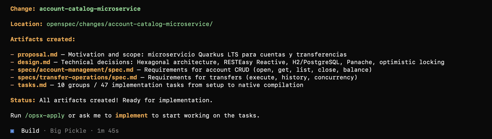

```shell
/opsx-apply
```
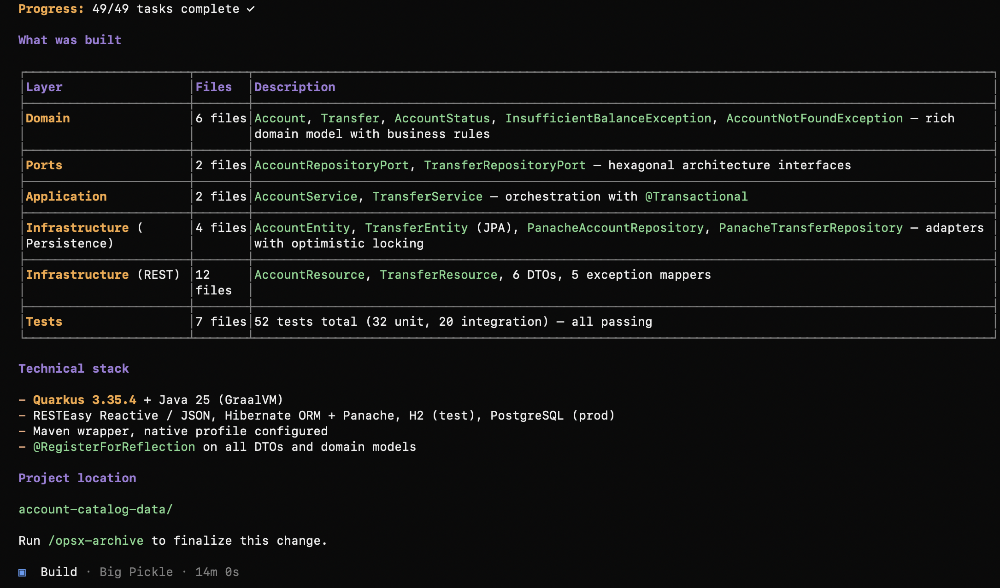

```shell
/opsx-propose quiero usar mejor la estrategia Active Record de Panache en lugar del patrón repository.
```
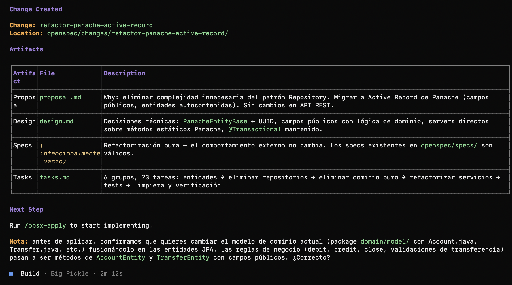

```shell
/opsx-apply
```
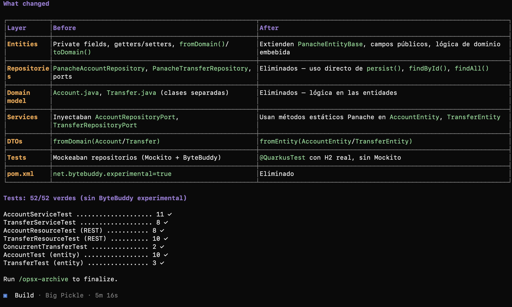

```shell
/opsx-propose quiero cambiar y que la cuenta sea un IBAN en lugar de un UUID
```
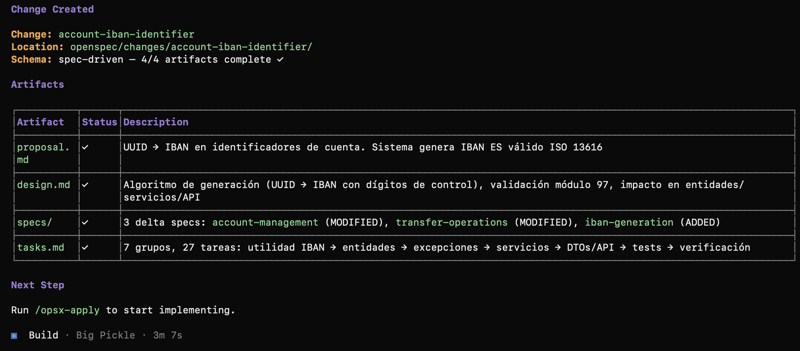

```shell
/opsx-apply
```
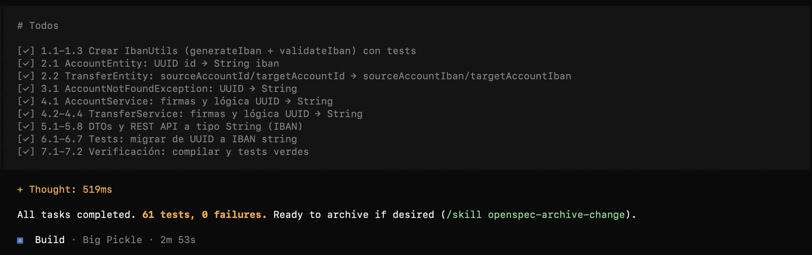

```shell
/opsx-propose quiero renombrar la paquetería
1) cambiar 'com.microbanco.account.infraestructura.persistence' por 'com.microbanco.account.entities'
2) al estar las entidades en ese paquete ya no necesitan llamarse AlgoEntity. El sufijo Entity sobra.
3) cambiar "com.microbanco.account.application" por "com.microbanco.account.services"
4) cambiar "com.microbanco.account.infrastructure.rest" por "com.microbanco.account.boundary"
5) cambiar "com.microbanco.account.infrastructure.rest.dto" por "com.microbanco.account.dto"
6) cambiar "com.microbanco.account.infrastructure.rest.exception" por "com.microbanco.account.exceptions" y reunificar mappers y excepciones en ese paquete.
7) creo que AccountApplication no vale para nada. Si es así, borradla.
8) AccountStatus ponlo como un enum anidado interno de la entidad Account
9) limpia los imports que ya no sean necesarios.
```
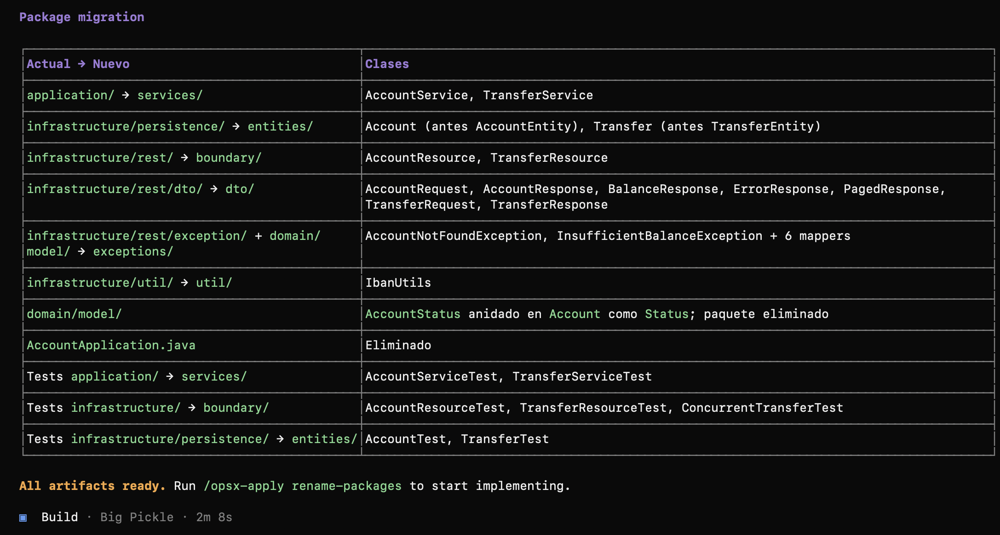

```shell
/opsx-apply
```
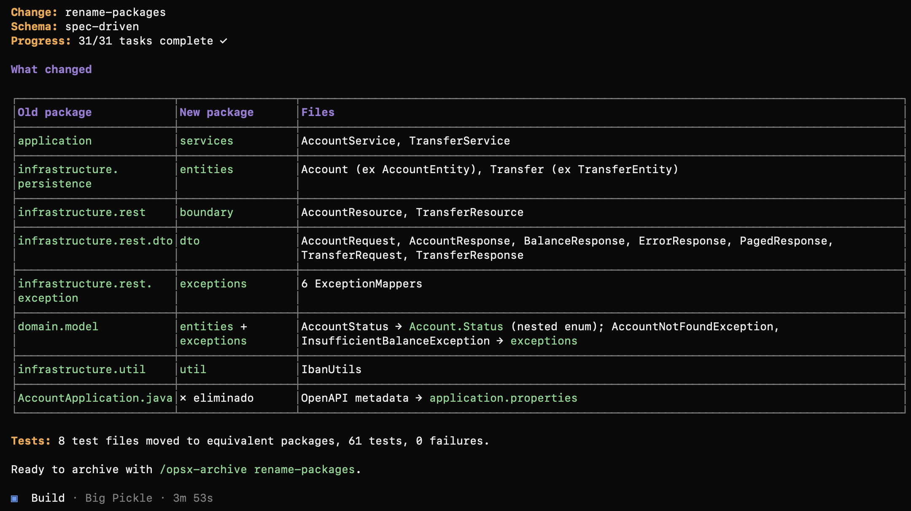

```shell 
/opsx-propose genera el serialVersionUID para las excepciones que son serializables y quita los imports que no se usen
```
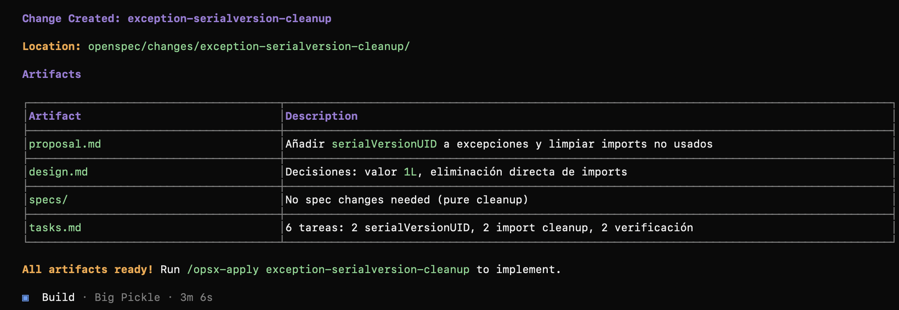

```shell 
/opsx-apply
```
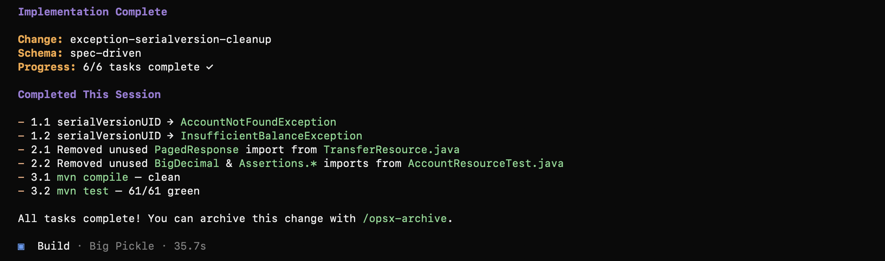

```shell 
/opsx-propose quiero añadir un frontal sobrio y elegante, con colores suaves, que se levante con el microservicio quarkus. No requiere autenticación, pues es una PoC. Y debe tener una pantalla para consultar la posición global, donde se verán las cuentas del usuario con su saldo y podrá dar de alta cuentas nuevas. Al entrar en una de las cuentas, se mostrará el saldo y la posibilidad de hacer transferencias hacia cuentas propias o externas utilizando las APIs existentes
```
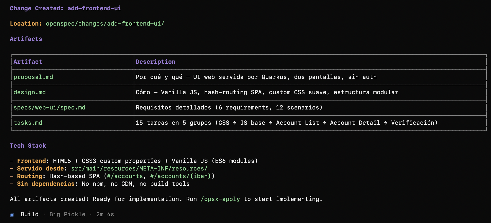

```shell 
/opsx-apply
```
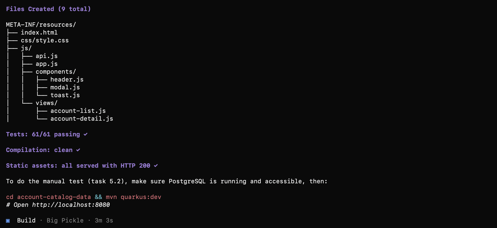

```shell 
/opsx-propose 
en el **back** quiero que al generar el IBAN siempre comiencen por 'ES' + checkDigits + '00830001' y luego 12 digitos aleatorios.
en el **frontal**, quiero que 
1) al introducir un IBAN se pueda introducir en bloques de cuatro caracteres separados por un espacio, pero cuando se envía al API que vaya sin los espacios. 
2) Por otro lado, cuando haces transferencias a otras cuentas que no están en nuestra entidad (que no empiecen por 'ES' + checkDigits + '00830001') que no muestre la validación de que la cuenta no existe
```
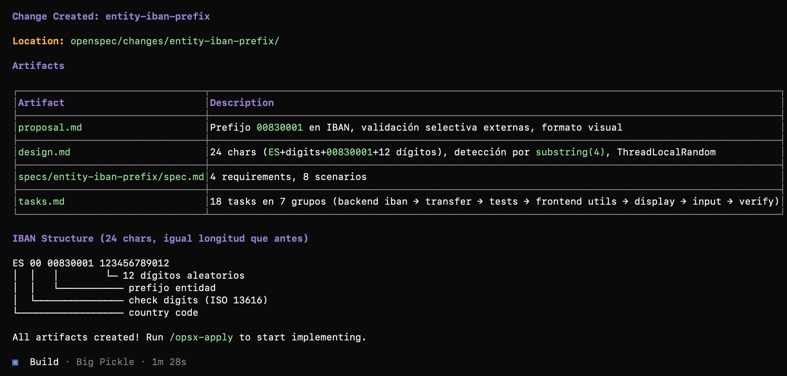

```shell 
/opsx-apply
```
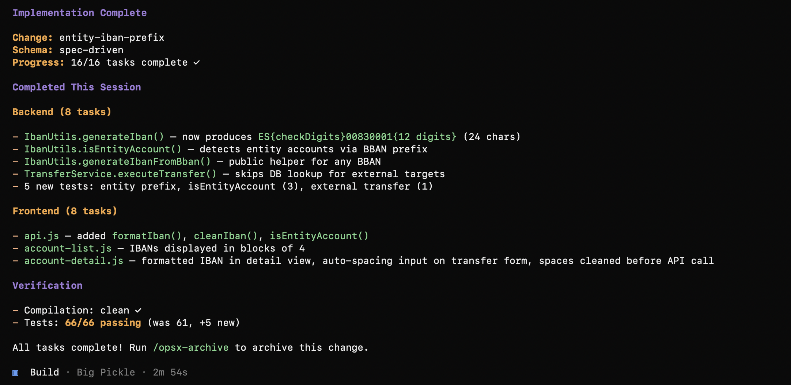